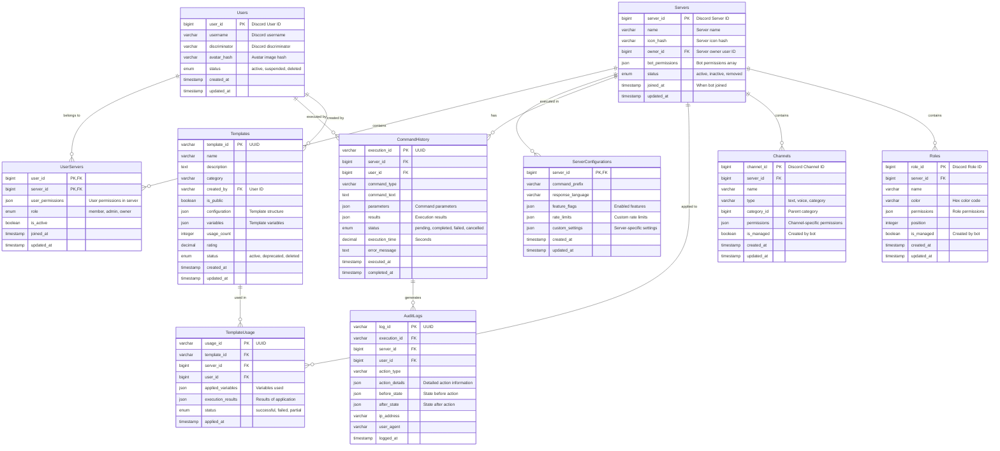

# Data Models and Architecture

## Overview
This document defines the data models, database schemas, and data flow architecture for the SetAi Bot system, covering both persistent storage (MySQL) and caching (Redis) layers.

## Database Architecture

### MySQL Schema Design

#### Core Entity Relationships


### Redis Data Structure

#### Cache Keys and TTL
```
# Server Data Cache
server:{server_id}:info              TTL: 1 hour
server:{server_id}:channels          TTL: 30 minutes
server:{server_id}:roles             TTL: 30 minutes
server:{server_id}:permissions       TTL: 15 minutes

# User Cache
user:{user_id}:profile               TTL: 2 hours
user:{user_id}:servers               TTL: 1 hour
user:{user_id}:permissions:{server_id} TTL: 15 minutes

# AI Processing Cache
ai:response:{hash}                   TTL: 24 hours
ai:context:{user_id}:{server_id}     TTL: 1 hour

# Rate Limiting
ratelimit:user:{user_id}             TTL: 1 minute
ratelimit:server:{server_id}         TTL: 1 minute
ratelimit:global                     TTL: 1 minute

# Session Management
session:{session_id}                 TTL: 30 minutes
command:execution:{execution_id}     TTL: 5 minutes

# Configuration Cache
config:server:{server_id}            TTL: 1 hour
config:global                        TTL: 6 hours
template:{template_id}               TTL: 2 hours
```

## Data Models

### User Models

#### User Profile
```typescript
interface UserProfile {
  user_id: string;                    // Discord User ID
  username: string;                   // Discord username
  discriminator: string;              // Discord discriminator
  avatar_hash?: string;               // Avatar image hash
  status: 'active' | 'suspended' | 'deleted';
  preferences: UserPreferences;
  created_at: Date;
  updated_at: Date;
}

interface UserPreferences {
  preferred_language: string;         // ISO language code
  timezone: string;                   // IANA timezone
  notifications: {
    command_completion: boolean;
    errors: boolean;
    system_updates: boolean;
  };
  ai_settings: {
    use_ai_interpretation: boolean;
    ai_confidence_threshold: number;
  };
}
```

#### User Server Relationship
```typescript
interface UserServer {
  user_id: string;
  server_id: string;
  user_permissions: DiscordPermission[];
  role: 'member' | 'admin' | 'owner';
  is_active: boolean;
  server_specific_settings: {
    custom_prefix?: string;
    disabled_features: string[];
  };
  joined_at: Date;
  updated_at: Date;
}
```

### Server Models

#### Server Configuration
```typescript
interface ServerConfiguration {
  server_id: string;
  name: string;
  icon_hash?: string;
  owner_id: string;
  bot_permissions: DiscordPermission[];
  settings: ServerSettings;
  status: 'active' | 'inactive' | 'removed';
  joined_at: Date;
  updated_at: Date;
}

interface ServerSettings {
  command_prefix: string;             // Default: "!setai"
  response_language: string;          // ISO language code
  feature_flags: {
    natural_language_processing: boolean;
    template_management: boolean;
    audit_logging: boolean;
    advanced_permissions: boolean;
    auto_cleanup: boolean;
  };
  rate_limits: {
    commands_per_user_per_minute: number;
    ai_requests_per_hour: number;
  };
  moderation: {
    require_admin_approval: boolean;
    log_channel_id?: string;
    restricted_commands: string[];
  };
}
```

### Command Models

#### Command Execution
```typescript
interface CommandExecution {
  execution_id: string;               // UUID
  server_id: string;
  user_id: string;
  command_type: CommandType;
  command_text: string;               // Original user input
  parameters: CommandParameters;
  ai_interpretation?: AIInterpretation;
  results: ExecutionResult[];
  status: 'pending' | 'in_progress' | 'completed' | 'failed' | 'cancelled';
  execution_time?: number;            // Seconds
  error_message?: string;
  executed_at: Date;
  completed_at?: Date;
}

type CommandType = 
  | 'channel_management'
  | 'role_management' 
  | 'permission_configuration'
  | 'server_configuration'
  | 'template_application'
  | 'bulk_operations';

interface CommandParameters {
  [key: string]: any;
  validation_rules?: ValidationRule[];
  execution_options?: {
    dry_run: boolean;
    confirm_before_execute: boolean;
    rollback_on_error: boolean;
  };
}

interface ExecutionResult {
  action: string;
  target_type: 'channel' | 'role' | 'permission' | 'setting';
  target_id?: string;
  success: boolean;
  details: any;
  error_message?: string;
  execution_time: number;
}
```

#### AI Interpretation
```typescript
interface AIInterpretation {
  original_text: string;
  confidence_score: number;           // 0.0 - 1.0
  intent: string;
  entities: ExtractedEntity[];
  structured_command: StructuredCommand;
  alternatives: StructuredCommand[];  // Alternative interpretations
  processing_time: number;            // Milliseconds
  model_used: string;                 // AI model identifier
  cached: boolean;
}

interface ExtractedEntity {
  type: 'channel_name' | 'role_name' | 'permission' | 'quantity' | 'category';
  value: string;
  confidence: number;
  position: {
    start: number;
    end: number;
  };
}

interface StructuredCommand {
  action: string;
  targets: CommandTarget[];
  modifiers: CommandModifier[];
  conditions: CommandCondition[];
}
```

### Template Models

#### Configuration Template
```typescript
interface ConfigurationTemplate {
  template_id: string;                // UUID
  name: string;
  description: string;
  category: TemplateCategory;
  created_by: string;                 // User ID
  is_public: boolean;
  version: string;                    // Semantic versioning
  configuration: TemplateConfiguration;
  variables: TemplateVariable[];
  metadata: TemplateMetadata;
  usage_stats: TemplateUsageStats;
  status: 'active' | 'deprecated' | 'deleted';
  created_at: Date;
  updated_at: Date;
}

type TemplateCategory = 
  | 'gaming'
  | 'education' 
  | 'business'
  | 'community'
  | 'moderation'
  | 'events'
  | 'custom';

interface TemplateConfiguration {
  categories: CategoryConfig[];
  channels: ChannelConfig[];
  roles: RoleConfig[];
  permissions: PermissionConfig[];
  settings: ServerSettingConfig[];
}

interface TemplateVariable {
  name: string;
  type: 'string' | 'number' | 'boolean' | 'select' | 'multiselect';
  description: string;
  required: boolean;
  default_value?: any;
  validation?: {
    min_length?: number;
    max_length?: number;
    pattern?: string;
    options?: string[];
  };
}

interface TemplateMetadata {
  tags: string[];
  estimated_execution_time: number;  // Seconds
  complexity_level: 'beginner' | 'intermediate' | 'advanced';
  discord_features_used: string[];
  preview_image_url?: string;
}
```

### Discord Entity Models

#### Channel Configuration
```typescript
interface ChannelConfig {
  name: string;
  type: 'text' | 'voice' | 'category' | 'stage' | 'forum';
  topic?: string;
  category?: string;                  // Category name or ID
  position?: number;
  permissions: PermissionOverride[];
  settings: ChannelSettings;
}

interface ChannelSettings {
  nsfw?: boolean;
  rate_limit_per_user?: number;       // Slowmode in seconds
  user_limit?: number;                // Voice channel user limit
  bitrate?: number;                   // Voice channel bitrate
  rtc_region?: string;                // Voice region
  auto_archive_duration?: number;     // Thread auto-archive duration
}

interface PermissionOverride {
  target_type: 'role' | 'user';
  target_id: string;
  allow: DiscordPermission[];
  deny: DiscordPermission[];
}
```

#### Role Configuration
```typescript
interface RoleConfig {
  name: string;
  color?: string;                     // Hex color code
  permissions: DiscordPermission[];
  mentionable?: boolean;
  hoisted?: boolean;                  // Display separately
  position?: number;
  icon?: string;                      // Role icon emoji or image
}

type DiscordPermission = 
  | 'create_instant_invite'
  | 'kick_members'
  | 'ban_members'
  | 'administrator'
  | 'manage_channels'
  | 'manage_guild'
  | 'add_reactions'
  | 'view_audit_log'
  | 'priority_speaker'
  | 'stream'
  | 'view_channel'
  | 'send_messages'
  | 'send_tts_messages'
  | 'manage_messages'
  | 'embed_links'
  | 'attach_files'
  | 'read_message_history'
  | 'mention_everyone'
  | 'use_external_emojis'
  | 'view_guild_insights'
  | 'connect'
  | 'speak'
  | 'mute_members'
  | 'deafen_members'
  | 'move_members'
  | 'use_voice_activation'
  | 'change_nickname'
  | 'manage_nicknames'
  | 'manage_roles'
  | 'manage_webhooks'
  | 'manage_emojis_and_stickers'
  | 'use_application_commands'
  | 'request_to_speak'
  | 'manage_events'
  | 'manage_threads'
  | 'create_public_threads'
  | 'create_private_threads'
  | 'use_external_stickers'
  | 'send_messages_in_threads'
  | 'start_embedded_activities'
  | 'moderate_members';
```

### Audit and Logging Models

#### Audit Log Entry
```typescript
interface AuditLogEntry {
  log_id: string;                     // UUID
  execution_id?: string;              // Related command execution
  server_id: string;
  user_id: string;
  action_type: AuditActionType;
  action_details: ActionDetails;
  before_state?: any;                 // State before action
  after_state?: any;                  // State after action
  metadata: AuditMetadata;
  logged_at: Date;
}

type AuditActionType = 
  | 'channel_created'
  | 'channel_modified'
  | 'channel_deleted'
  | 'role_created'
  | 'role_modified'
  | 'role_deleted'
  | 'permission_granted'
  | 'permission_revoked'
  | 'template_applied'
  | 'configuration_changed'
  | 'command_executed'
  | 'error_occurred';

interface ActionDetails {
  target_type: string;
  target_id?: string;
  target_name?: string;
  action_parameters: any;
  impact_scope: 'server' | 'channel' | 'role' | 'user';
  affected_entities: string[];
}

interface AuditMetadata {
  ip_address?: string;
  user_agent?: string;
  api_version: string;
  execution_source: 'discord_command' | 'api_call' | 'template_application';
  correlation_id: string;
}
```

### Performance and Analytics Models

#### System Metrics
```typescript
interface SystemMetrics {
  timestamp: Date;
  period: 'minute' | 'hour' | 'day';
  bot_metrics: BotMetrics;
  api_metrics: APIMetrics;
  database_metrics: DatabaseMetrics;
  cache_metrics: CacheMetrics;
}

interface BotMetrics {
  active_instances: number;
  total_servers: number;
  total_users: number;
  commands_executed: number;
  commands_successful: number;
  commands_failed: number;
  average_response_time: number;
  ai_requests: number;
  ai_success_rate: number;
}

interface APIMetrics {
  requests_total: number;
  requests_per_minute: number;
  average_response_time: number;
  error_rate: number;
  active_sessions: number;
  cache_hit_rate: number;
}

interface DatabaseMetrics {
  mysql_connections_active: number;
  mysql_queries_per_second: number;
  mysql_average_query_time: number;
  redis_connections_active: number;
  redis_memory_usage: number;
  redis_operations_per_second: number;
}
```

## Data Validation Rules

### Input Validation
```typescript
interface ValidationRule {
  field: string;
  type: 'required' | 'length' | 'pattern' | 'custom';
  parameters: any;
  error_message: string;
}

// Example validation rules
const channelValidation: ValidationRule[] = [
  {
    field: 'name',
    type: 'required',
    parameters: {},
    error_message: 'Channel name is required'
  },
  {
    field: 'name',
    type: 'length',
    parameters: { min: 1, max: 100 },
    error_message: 'Channel name must be 1-100 characters'
  },
  {
    field: 'name',
    type: 'pattern',
    parameters: { pattern: '^[a-z0-9-_]+$' },
    error_message: 'Channel name must contain only lowercase letters, numbers, hyphens, and underscores'
  }
];
```

### Business Logic Constraints
```typescript
interface BusinessConstraint {
  name: string;
  description: string;
  validation_function: (data: any, context: any) => ValidationResult;
  error_action: 'block' | 'warn' | 'log';
}

interface ValidationResult {
  valid: boolean;
  error_message?: string;
  suggested_fix?: string;
}
```

## Data Migration and Versioning

### Schema Versioning
```sql
-- Migration tracking table
CREATE TABLE schema_migrations (
  version VARCHAR(50) PRIMARY KEY,
  description TEXT,
  applied_at TIMESTAMP DEFAULT CURRENT_TIMESTAMP,
  checksum VARCHAR(64)
);

-- Example migration
-- Version: 2024_08_15_001_create_base_tables
-- Description: Create initial database schema
```

### Data Backup Strategy
- **Full Backups**: Daily at 2 AM UTC
- **Incremental Backups**: Every 6 hours
- **Point-in-time Recovery**: Available for 30 days
- **Cross-region Replication**: Primary (US-East), Secondary (EU-West)

---

**Document Type**: Data Models and Architecture  
**Version**: 1.0  
**Last Updated**: August 2024  
**Related**: [API Specifications](./api-specifications.md)