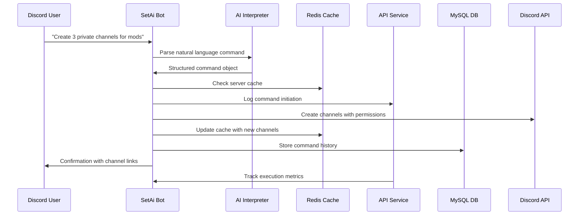

# SetAi Bot - Project Architecture

## 📋 Executive Summary

SetAi Bot is an intelligent Discord bot that leverages AI to automate server configuration through natural language processing. The system interprets user commands in plain English and executes complex server setup tasks automatically.

**Vision**: Transform Discord server management from manual, time-consuming tasks to simple conversational commands.

## 🎯 Project Goals

### Primary Objectives
- **Automated Server Configuration**: Complete Discord server setup through AI-interpreted commands
- **Natural Language Interface**: Users interact using everyday language, not technical syntax
- **Comprehensive Management**: Handle channels, roles, permissions, categories, and server settings
- **Real-time Operations**: Immediate execution and feedback for configuration tasks

### Success Metrics
- Reduce server setup time by 80%+
- Support 95% of common Discord configuration scenarios
- Achieve <2 second response time for simple commands
- Maintain 99.9% uptime for critical operations

## 🏗️ System Architecture Overview

The SetAi Bot system follows a microservices architecture with four main components:

```
┌─────────────────┐    ┌─────────────────┐    ┌─────────────────┐
│   Discord User  │    │   Discord API   │    │  External APIs  │
└─────────┬───────┘    └─────────┬───────┘    └─────────┬───────┘
          │                      │                      │
          │ Natural Language     │ Bot Actions          │ AI/NLP
          │ Commands             │                      │ Services
          │                      │                      │
    ┌─────▼──────────────────────▼──────────────────────▼─────┐
    │                 SetAi Bot Core                          │
    │  ┌─────────────┐  ┌─────────────┐  ┌─────────────┐    │
    │  │   Command   │  │     AI      │  │   Discord   │    │
    │  │  Processor  │  │ Interpreter │  │  Interface  │    │
    │  └─────────────┘  └─────────────┘  └─────────────┘    │
    └─────┬───────────────────┬───────────────────┬─────────┘
          │                   │                   │
          │ API Calls         │ Cache Operations  │ Persistence
          │                   │                   │
    ┌─────▼─────┐      ┌──────▼──────┐     ┌──────▼──────┐
    │    API    │      │    Redis    │     │    MySQL    │
    │  Service  │      │   Cache/    │     │  Database   │
    │           │      │   Pub/Sub   │     │             │
    └───────────┘      └─────────────┘     └─────────────┘
```

## 🔧 Core Components

### 1. Discord Bot (`SetAi Bot Core`)
**Purpose**: Primary interface for user interactions and Discord API communication

**Key Responsibilities**:
- Process incoming Discord messages and commands
- Parse natural language using AI interpretation
- Execute Discord server configuration tasks
- Provide real-time feedback to users
- Manage bot permissions and authentication

**Technology Stack**:
- Node.js runtime
- Discord.js library for Discord API integration
- Natural Language Processing (OpenAI GPT/similar)
- Event-driven architecture

### 2. API Service
**Purpose**: Centralized business logic and external service orchestration

**Key Responsibilities**:
- Receive execution status from bot (task count, progress tracking)
- Send control commands to enable/disable bot features
- Coordinate between bot instances for multi-server deployments
- Handle authentication and authorization
- Manage rate limiting and API quotas

**Technology Stack**:
- RESTful API (Node.js/Express or similar)
- JWT authentication
- Rate limiting middleware
- Health monitoring endpoints

### 3. Redis Cache & Pub/Sub
**Purpose**: High-performance caching and real-time communication

**Key Responsibilities**:
- Cache frequently accessed Discord data (servers, channels, roles)
- Pub/Sub messaging between bot instances
- Session management for multi-step commands
- Real-time progress tracking for long-running operations
- Temporary storage for AI processing results

**Data Patterns**:
- Command session state
- Server configuration templates
- User preference caching
- Rate limiting counters

### 4. MySQL Database
**Purpose**: Persistent data storage for long-term operations

**Key Responsibilities**:
- Store user profiles and preferences
- Maintain server configuration history
- Log command execution for auditing
- Store custom templates and macros
- Analytics and usage tracking

**Data Models**:
- Users, Servers, Commands, Templates, Audit Logs

## 🔄 Data Flow Architecture

### Command Processing Workflow



### Communication Patterns

1. **Bot ↔ API**: RESTful HTTP for control and monitoring
2. **Bot ↔ Redis**: Direct connection for caching and pub/sub
3. **API ↔ Redis**: Session state and real-time updates
4. **API ↔ MySQL**: Standard database operations
5. **Bot ↔ Discord API**: Official Discord.js WebSocket connection

## 🚀 Deployment Architecture

### Production Environment
- **Containerization**: Docker containers for each service
- **Orchestration**: Docker Compose or Kubernetes
- **Load Balancing**: NGINX for API service
- **Monitoring**: Prometheus + Grafana
- **Logging**: ELK Stack (Elasticsearch, Logstash, Kibana)

### Development Environment
- Local Docker Compose setup
- Hot reloading for development
- Test Discord server for safe testing
- Mock external APIs for offline development

## 📊 Scalability Considerations

### Horizontal Scaling
- Multiple bot instances using Redis for coordination
- API service behind load balancer
- Database read replicas for heavy read operations
- Redis cluster for high-availability caching

### Performance Optimization
- Command result caching (Redis)
- Database connection pooling
- Async/await patterns for non-blocking operations
- Batch processing for bulk operations

## 🔒 Security & Compliance

### Authentication & Authorization
- Discord OAuth2 for user authentication
- JWT tokens for API access
- Role-based permissions aligned with Discord roles
- API key management for external services

### Data Protection
- Encryption at rest (database)
- Encryption in transit (TLS/SSL)
- Personal data anonymization options
- GDPR compliance for EU users

### Bot Security
- Minimum required Discord permissions
- Input validation and sanitization
- Rate limiting to prevent abuse
- Audit logging for all configuration changes

## 📈 Monitoring & Analytics

### Key Metrics
- Command success rate
- Response time distribution
- Error rates by command type
- User engagement metrics
- Server configuration patterns

### Alerting
- Bot offline notifications
- Database connection failures
- High error rates
- API rate limit approaching

## 🔮 Future Roadmap

### Phase 1: Core Implementation
- Basic natural language command processing
- Essential Discord configuration (channels, roles)
- Simple API for bot control
- Redis caching implementation

### Phase 2: Advanced Features
- Complex multi-step configurations
- Custom template system
- Web dashboard for server admins
- Advanced analytics and reporting

### Phase 3: AI Enhancement
- Learning from user patterns
- Predictive configuration suggestions
- Voice command integration
- Multi-language support

## 📚 Related Documentation

- [C4 Architecture Diagrams](../diagrams/README.md)
- [API Specifications](../api/api-specifications.md)
- [Technical Requirements](../requirements/technical-requirements.md)
- [Installation Guide](../requirements/installation-guide.md)

---

**Last Updated**: August 2024  
**Version**: 1.0  
**Status**: Initial Design Phase