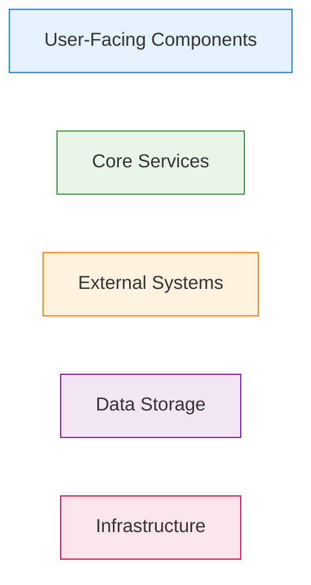

# Architecture Diagrams

This directory contains comprehensive architectural diagrams for the SetAi Discord Bot system, created using Mermaid syntax for easy viewing and maintenance.

## 📊 Diagram Types

### 🏗️ C4 Architecture Diagrams
C4 (Context, Containers, Components, Code) diagrams provide a hierarchical view of the system architecture at different levels of abstraction.

#### [Level 1: System Context](./c4-level1-system-context.md)
- **Purpose**: Shows the system in its environment
- **Audience**: All stakeholders
- **Focus**: External users and systems that interact with SetAi Bot
- **Key Elements**: Discord users, server admins, external APIs

#### [Level 2: Container Diagram](./c4-level2-containers.md)  
- **Purpose**: Shows high-level technology choices and containers
- **Audience**: Technical stakeholders, architects
- **Focus**: Major applications, services, and data stores
- **Key Elements**: Bot application, API service, databases, AI processor

#### [Level 3: Component Diagram](./c4-level3-components.md)
- **Purpose**: Shows components within the Discord Bot container
- **Audience**: Developers, technical leads
- **Focus**: Internal structure and component interactions
- **Key Elements**: Message handlers, command routers, services, managers

#### [Level 4: Code Diagram](./c4-level4-code.md)
- **Purpose**: Shows detailed class structure and relationships
- **Audience**: Developers implementing the system
- **Focus**: Classes, interfaces, and design patterns
- **Key Elements**: Class diagrams, method signatures, relationships

### 🔄 Process Flowcharts
[Process Flowcharts](./process-flowcharts.md) illustrate the key workflows and processes within the system.

#### Command Processing Workflows
- **Main Command Flow**: Complete user command processing pipeline
- **AI Processing Subflow**: Natural language interpretation workflow
- **Permission Validation Flow**: Multi-layer permission checking

#### System Communication Flows
- **Bot-API-Redis-MySQL Coordination**: Inter-service communication patterns
- **Error Handling and Recovery**: Error processing and recovery workflows
- **Multi-Step Command Execution**: Complex operation handling

#### Performance Optimization Flows
- **Caching Strategy Flow**: Multi-level caching implementation
- **Load Balancing Flow**: Request distribution and scaling

## 🎯 How to Use These Diagrams

### For Project Planning
1. Start with **Level 1 (System Context)** to understand scope and boundaries
2. Review **Level 2 (Container)** for technology decisions and deployment architecture
3. Use **Process Flowcharts** to understand user journeys and system workflows

### For Development
1. Study **Level 3 (Component)** for internal architecture understanding
2. Reference **Level 4 (Code)** for implementation details and patterns
3. Follow **Process Flowcharts** for workflow implementation

### For Operations
1. Use **Container Diagram** for deployment and infrastructure planning
2. Reference **Process Flowcharts** for monitoring and troubleshooting
3. Apply **Error Handling Flows** for incident response procedures

## 🔧 Diagram Technology

### Mermaid Syntax
All diagrams use [Mermaid](https://mermaid-js.github.io/mermaid/) syntax, which provides:
- **Version Control Friendly**: Text-based diagrams in Git
- **GitHub Integration**: Automatic rendering in GitHub
- **Easy Maintenance**: Simple syntax for updates
- **Consistent Styling**: Standardized appearance

### Viewing Diagrams
These diagrams can be viewed in:
- **GitHub**: Native Mermaid rendering
- **VS Code**: Mermaid Preview extension
- **Mermaid Live Editor**: [https://mermaid.live](https://mermaid.live)
- **Documentation Sites**: GitBook, Notion, etc.

### Editing Diagrams
To modify diagrams:
1. Edit the Mermaid syntax directly in the markdown files
2. Test changes in [Mermaid Live Editor](https://mermaid.live)
3. Commit changes to Git for version control

## 📋 Diagram Conventions

### Color Coding

- **Blue**: User-facing components and interfaces
- **Green**: Core application services and logic
- **Orange**: External systems and third-party services
- **Purple**: Data storage and persistence layers
- **Pink**: Infrastructure and deployment components

### Naming Conventions
- **PascalCase**: For containers and major components
- **snake_case**: For technical identifiers and database entities
- **kebab-case**: For file names and URLs
- **UPPER_CASE**: For constants and environment variables

### Relationship Types
- **Solid Lines**: Direct dependencies and strong relationships
- **Dashed Lines**: Indirect dependencies and weak relationships
- **Thick Lines**: High-volume or critical data flows
- **Arrows**: Direction of data flow or dependency

## 📈 Diagram Maintenance

### Update Schedule
- **Monthly Review**: Check for architectural changes
- **Feature Updates**: Update diagrams when adding new features
- **Version Releases**: Ensure diagrams match released versions
- **Documentation Sprints**: Comprehensive review and updates

### Version Control
- All diagrams are version controlled with the codebase
- Major architectural changes require diagram updates
- Deprecated patterns should be marked and eventually removed
- Historical versions available through Git history

### Quality Assurance
- Diagrams should be reviewed with code changes
- Regular validation against actual implementation
- Consistency checks across all diagram levels
- Stakeholder review for accuracy and completeness

## 🔗 Related Documentation

### Architecture Documentation
- [Project Architecture Overview](../architecture/project-architecture.md)
- [Technical Requirements](../requirements/technical-requirements.md)
- [Installation Guide](../requirements/installation-guide.md)

### API Documentation
- [API Specifications](../api/api-specifications.md)
- [Data Models](../api/data-models.md)

### Implementation Guides
- [Command Specifications](../requirements/command-specifications.md)
- [Development Guidelines](../requirements/development-guidelines.md)

## 🚀 Future Enhancements

### Planned Diagram Additions
- **Deployment Diagrams**: Infrastructure and deployment topology
- **Sequence Diagrams**: Detailed interaction flows
- **State Diagrams**: Bot and system state management
- **Network Diagrams**: Network topology and security zones

### Interactive Features
- **Clickable Diagrams**: Links to related documentation
- **Dynamic Diagrams**: Real-time system state visualization
- **Animated Flows**: Step-by-step process visualization
- **3D Architecture**: Immersive system exploration

### Automation
- **Diagram Generation**: Auto-generate from code annotations
- **Consistency Checking**: Automated validation against codebase
- **Update Notifications**: Alert when diagrams need updates
- **Integration Testing**: Validate diagram accuracy in CI/CD

---

**Last Updated**: August 2024  
**Maintained By**: SetAi Bot Development Team  
**Review Frequency**: Monthly