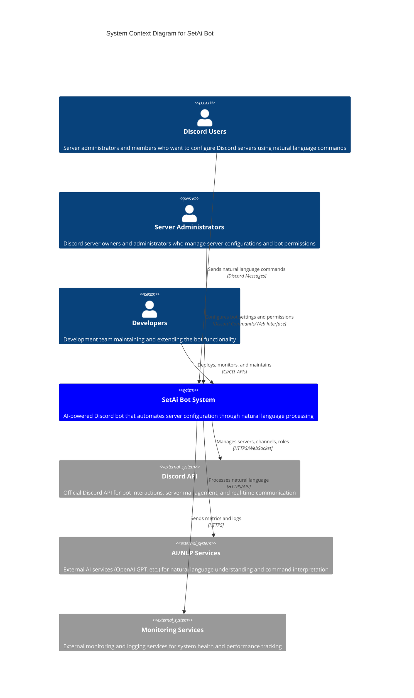

# C4 Level 1: System Context Diagram

## Overview
This diagram shows the SetAi Bot system in its environment, illustrating the key users and external systems that interact with it.

## System Context

## Key Relationships

### User Interactions

| Actor | Interaction | Purpose | Technology |
|-------|-------------|---------|------------|
| **Discord Users** | Send commands | Request server configurations | Discord chat interface |
| **Server Admins** | Configure bot | Set permissions, enable features | Discord commands + Web dashboard |
| **Developers** | System maintenance | Deploy updates, monitor performance | CI/CD pipelines, APIs |

### External System Integrations

| System | Purpose | Communication | Data Exchange |
|--------|---------|---------------|---------------|
| **Discord API** | Primary platform interface | HTTPS REST + WebSocket | Server data, user permissions, real-time events |
| **AI/NLP Services** | Command interpretation | HTTPS REST | Natural language text → structured commands |
| **Monitoring Services** | System observability | HTTPS/TCP | Metrics, logs, alerts, health status |

## System Boundaries

### What's Inside the System
- Discord bot application
- API service for bot control
- Redis cache and pub/sub
- MySQL database
- Command processing logic
- AI integration layer

### What's Outside the System
- Discord platform and infrastructure
- External AI/NLP providers
- Monitoring and logging platforms
- User devices and Discord clients
- Third-party integrations

## Key System Capabilities

### For Discord Users
- **Natural Language Commands**: "Create 3 private channels for the moderation team"
- **Immediate Feedback**: Real-time confirmation of actions taken
- **Error Handling**: Clear explanations when commands cannot be executed
- **Help System**: Guidance on available commands and syntax

### For Server Administrators
- **Permission Management**: Control what the bot can do in their server
- **Feature Toggle**: Enable/disable specific bot capabilities
- **Audit Trail**: View history of all bot actions
- **Custom Templates**: Save and reuse common configurations

### For Developers
- **API Access**: Programmatic control of bot features
- **Monitoring Dashboard**: Real-time system health and performance
- **Analytics**: Usage patterns and system metrics
- **Configuration Management**: Environment-specific settings

## Security Considerations

### Authentication
- Discord OAuth2 for user identity
- Bot tokens for Discord API access
- API keys for external AI services
- Role-based access control

### Authorization
- Discord permission system integration
- Server-specific bot permissions
- Admin-only configuration commands
- Rate limiting and abuse prevention

### Data Privacy
- Minimal data collection
- Encrypted data transmission
- Temporary storage of command context
- GDPR compliance measures

## External Dependencies

### Critical Dependencies
- **Discord API**: Core functionality depends on Discord platform availability
- **AI Services**: Natural language processing requires external AI providers
- **Internet Connectivity**: All operations require stable internet connection

### Optional Dependencies
- **Monitoring Services**: System can operate without external monitoring
- **Third-party Integrations**: Additional features may integrate with other services

## Scalability Context

### User Growth
- Designed to handle multiple Discord servers simultaneously
- Horizontal scaling through multiple bot instances
- Load balancing for high-traffic servers

### Geographic Distribution
- Global deployment for reduced latency
- Regional data compliance (GDPR, etc.)
- Multi-region failover capabilities

---

**Diagram Type**: C4 Level 1 - System Context  
**Last Updated**: August 2024  
**Related**: [Level 2 Container Diagram](./c4-level2-containers.md)