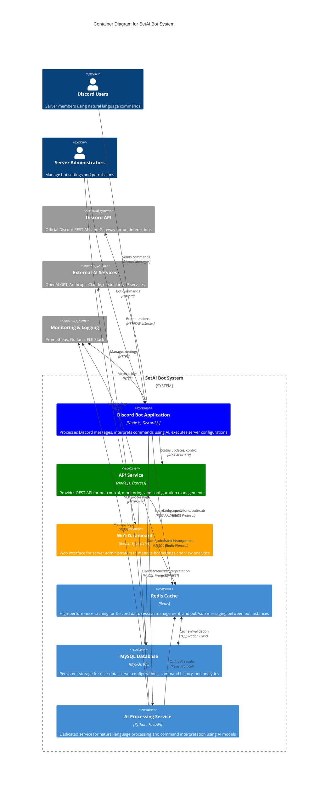

# C4 Level 2: Container Diagram

## Overview
This diagram zooms into the SetAi Bot system to show the high-level containers (applications, data stores, microservices) and how they interact with each other and external systems.

## Container Architecture



## Container Responsibilities

### Discord Bot Application
**Technology**: Node.js, Discord.js, TypeScript  
**Primary Purpose**: Core bot functionality and Discord integration

**Key Responsibilities**:
- Listen for Discord messages and commands
- Validate user permissions and bot capabilities
- Coordinate with AI processor for command interpretation
- Execute Discord API calls for server configuration
- Provide real-time feedback to users
- Manage bot presence and status

**Scaling**: Multiple instances can run simultaneously, coordinated via Redis pub/sub

### API Service
**Technology**: Node.js, Express, TypeScript  
**Primary Purpose**: Central business logic and external interface

**Key Responsibilities**:
- REST API for bot control and configuration
- Authentication and authorization management
- Rate limiting and request validation
- Webhook handling for external integrations
- Analytics data aggregation
- Health monitoring endpoints

**Scaling**: Horizontal scaling behind load balancer

### Web Dashboard
**Technology**: React, TypeScript, Material-UI  
**Primary Purpose**: Administrative interface for server managers

**Key Responsibilities**:
- Server configuration management
- Bot permission settings
- Analytics and usage dashboards
- Command history and audit logs
- Template management for common configurations
- Real-time status monitoring

**Deployment**: Static files served via CDN

### AI Processing Service
**Technology**: Python, FastAPI, PyTorch/TensorFlow  
**Primary Purpose**: Natural language understanding and command parsing

**Key Responsibilities**:
- Parse natural language commands into structured data
- Intent recognition and entity extraction
- Context management for multi-step commands
- Command validation and safety checks
- Learning from user interactions
- Integration with multiple AI providers

**Scaling**: Auto-scaling based on processing queue length

### Redis Cache
**Technology**: Redis 7.0 with clustering  
**Primary Purpose**: High-performance caching and real-time communication

**Key Responsibilities**:
- Cache Discord server data (channels, roles, permissions)
- Session management for multi-step commands
- Pub/sub messaging between bot instances
- Rate limiting counters
- Temporary storage for AI processing results
- Real-time progress tracking

**Scaling**: Redis cluster for high availability

### MySQL Database
**Technology**: MySQL 8.0 with read replicas  
**Primary Purpose**: Persistent data storage

**Key Responsibilities**:
- User profiles and preferences
- Server configuration templates
- Command execution history
- Analytics and usage metrics
- Audit logs for compliance
- Bot configuration settings

**Scaling**: Master-slave replication with read replicas

## Data Flow Patterns

### Command Processing Flow
1. **User Input** → Discord Bot receives message
2. **Permission Check** → Validate user/server permissions
3. **AI Processing** → Send to AI processor for interpretation
4. **Cache Lookup** → Check Redis for server data
5. **Execution** → Perform Discord API operations
6. **Logging** → Store results in MySQL
7. **Feedback** → Respond to user with confirmation

### Configuration Management Flow
1. **Admin Access** → Web Dashboard authentication
2. **Settings Update** → API Service validates changes
3. **Database Update** → Store new configuration in MySQL
4. **Cache Invalidation** → Update Redis cache
5. **Bot Notification** → Notify bot instances via pub/sub
6. **Apply Changes** → Bot instances update their behavior

## Inter-Container Communication

### Synchronous Communication
| From | To | Protocol | Purpose |
|------|----|-----------|---------| 
| Discord Bot | API Service | HTTP/REST | Status updates, configuration retrieval |
| Web Dashboard | API Service | HTTPS/REST | Administrative operations |
| Discord Bot | AI Processor | HTTP/REST | Command interpretation |
| AI Processor | External AI | HTTPS | Natural language processing |

### Asynchronous Communication
| From | To | Protocol | Purpose |
|------|----|-----------|---------| 
| Discord Bot | Redis | Redis Protocol | Pub/sub messaging, caching |
| API Service | Redis | Redis Protocol | Session management |
| All Services | MySQL | MySQL Protocol | Persistent data operations |

## Security Architecture

### Network Security
- All external communication over HTTPS/TLS
- Internal service communication via encrypted channels
- VPC/network isolation for production deployments
- Firewall rules restricting unnecessary access

### Authentication & Authorization
- Discord OAuth2 for user authentication
- JWT tokens for API access
- Service-to-service authentication via API keys
- Role-based access control (RBAC)

### Data Security
- Encryption at rest for database
- Encryption in transit for all communications
- Secrets management via environment variables/vault
- Regular security audits and updates

## Deployment Considerations

### Container Orchestration
```yaml
# Example Docker Compose structure
services:
  discord-bot:
    replicas: 2
    depends_on: [redis, mysql, api-service]
  
  api-service:
    replicas: 3
    depends_on: [redis, mysql]
  
  ai-processor:
    replicas: 2
    depends_on: [redis]
  
  web-dashboard:
    deploy: static-files
  
  redis:
    deploy: cluster
    replicas: 3
  
  mysql:
    deploy: master-slave
    replicas: 2
```

### Health Monitoring
- Health check endpoints for all services
- Dependency health verification
- Circuit breaker patterns for external services
- Graceful degradation strategies

---

**Diagram Type**: C4 Level 2 - Container Diagram  
**Last Updated**: August 2024  
**Related**: [Level 3 Component Diagram](./c4-level3-components.md)