# C4 Level 3: Component Diagram

## Overview
This diagram zooms into the Discord Bot Application container to show its internal components and how they collaborate to provide the bot's functionality.

## Discord Bot Application Components

```mermaid
C4Component
    title Component Diagram for Discord Bot Application

    Container(api_service, "API Service", "Node.js, Express", "Bot control and monitoring")
    Container(redis_cache, "Redis Cache", "Redis", "Caching and pub/sub")
    Container(mysql_db, "MySQL Database", "MySQL", "Persistent storage")
    Container(ai_processor, "AI Processing Service", "Python, FastAPI", "Command interpretation")
    
    System_Ext(discord_api, "Discord API", "Discord REST API and Gateway")

    Container_Boundary(discord_bot, "Discord Bot Application") {
        Component(message_handler, "Message Handler", "Discord.js Event Listeners", "Receives and filters Discord messages, determines if they are bot commands")
        
        Component(command_router, "Command Router", "Command Pattern", "Routes parsed commands to appropriate handlers based on command type and context")
        
        Component(permission_manager, "Permission Manager", "Authorization Logic", "Validates user permissions and bot capabilities before executing commands")
        
        Component(ai_integration, "AI Integration", "HTTP Client", "Interfaces with AI processing service for natural language interpretation")
        
        Component(discord_service, "Discord Service", "Discord.js Wrapper", "Abstracts Discord API operations for channels, roles, permissions, and server management")
        
        Component(cache_manager, "Cache Manager", "Redis Client", "Manages caching of Discord data and coordinates with other bot instances via pub/sub")
        
        Component(config_manager, "Configuration Manager", "Config Handler", "Manages bot configuration, feature flags, and runtime settings")
        
        Component(audit_logger, "Audit Logger", "Logging Service", "Records all bot actions and command executions for compliance and debugging")
        
        Component(error_handler, "Error Handler", "Error Management", "Centralized error handling, user-friendly error messages, and system recovery")
        
        Component(rate_limiter, "Rate Limiter", "Rate Limiting Logic", "Prevents spam and abuse by limiting command frequency per user/server")
        
        Component(template_engine, "Template Engine", "Configuration Templates", "Processes predefined server configuration templates and macros")
        
        Component(health_monitor, "Health Monitor", "Health Checks", "Monitors bot health and reports status to API service and monitoring systems")
    }

    Rel(discord_api, message_handler, "Discord Events", "WebSocket")
    
    Rel(message_handler, command_router, "Parsed commands", "Internal")
    Rel(message_handler, rate_limiter, "Check limits", "Internal")
    Rel(message_handler, audit_logger, "Log events", "Internal")
    
    Rel(command_router, permission_manager, "Validate permissions", "Internal")
    Rel(command_router, ai_integration, "Interpret commands", "Internal")
    Rel(command_router, template_engine, "Apply templates", "Internal")
    
    Rel(permission_manager, cache_manager, "Check cached permissions", "Internal")
    Rel(permission_manager, discord_service, "Verify Discord permissions", "Internal")
    
    Rel(ai_integration, ai_processor, "Command interpretation", "HTTP")
    Rel(ai_integration, cache_manager, "Cache AI results", "Internal")
    
    Rel(discord_service, discord_api, "API operations", "HTTPS")
    Rel(discord_service, cache_manager, "Cache Discord data", "Internal")
    Rel(discord_service, audit_logger, "Log actions", "Internal")
    
    Rel(cache_manager, redis_cache, "Cache operations", "Redis Protocol")
    
    Rel(config_manager, api_service, "Fetch configuration", "HTTP")
    Rel(config_manager, cache_manager, "Cache config", "Internal")
    
    Rel(audit_logger, mysql_db, "Store logs", "MySQL")
    
    Rel(error_handler, audit_logger, "Log errors", "Internal")
    Rel(error_handler, discord_service, "Send error messages", "Internal")
    Rel(error_handler, health_monitor, "Report errors", "Internal")
    
    Rel(template_engine, cache_manager, "Cache templates", "Internal")
    Rel(template_engine, mysql_db, "Load templates", "MySQL")
    
    Rel(health_monitor, api_service, "Health status", "HTTP")

    UpdateElementStyle(message_handler, $fontColor="white", $bgColor="blue", $borderColor="navy")
    UpdateElementStyle(command_router, $fontColor="white", $bgColor="green", $borderColor="darkgreen")
    UpdateElementStyle(discord_service, $fontColor="white", $bgColor="purple", $borderColor="darkpurple")
```

## Component Responsibilities

### Message Handler
**Pattern**: Event-Driven Architecture  
**Purpose**: Entry point for all Discord interactions

**Responsibilities**:
- Listen to Discord Gateway events (messages, reactions, member updates)
- Filter messages to identify bot commands
- Parse command syntax and extract parameters
- Handle Discord slash commands and message commands
- Manage bot presence and status updates
- Forward events to appropriate handlers

**Key Methods**:
- `onMessage(message)`: Process incoming Discord messages
- `onSlashCommand(interaction)`: Handle Discord slash commands
- `onReactionAdd(reaction, user)`: Process reaction-based interactions
- `updatePresence(status)`: Update bot status and activity

### Command Router
**Pattern**: Command Pattern with Strategy  
**Purpose**: Route commands to appropriate execution handlers

**Responsibilities**:
- Match commands to execution strategies
- Validate command syntax and parameters
- Handle command aliases and variations
- Manage command execution pipeline
- Coordinate complex multi-step operations
- Queue long-running commands

**Key Methods**:
- `routeCommand(command, context)`: Route to appropriate handler
- `executeCommand(strategy, params)`: Execute command strategy
- `validateSyntax(command)`: Validate command structure
- `queueLongRunning(command)`: Handle complex operations

### Permission Manager
**Pattern**: Role-Based Access Control (RBAC)  
**Purpose**: Security and authorization management

**Responsibilities**:
- Validate user permissions for commands
- Check bot permissions in Discord servers
- Enforce server-specific permission rules
- Handle permission inheritance and overrides
- Cache permission data for performance
- Audit permission changes

**Key Methods**:
- `checkUserPermission(user, command, server)`: Validate user access
- `checkBotPermission(permission, channel)`: Verify bot capabilities
- `enforceServerRules(server, command)`: Apply server-specific rules
- `cachePermissions(server, permissions)`: Cache permission data

### AI Integration
**Pattern**: Facade with Circuit Breaker  
**Purpose**: Interface with external AI services

**Responsibilities**:
- Send natural language commands to AI processor
- Handle AI service timeouts and failures
- Cache frequently used AI interpretations
- Manage context for multi-turn conversations
- Validate AI responses for safety
- Fallback to rule-based parsing when AI fails

**Key Methods**:
- `interpretCommand(text, context)`: Parse natural language
- `validateResponse(aiResponse)`: Ensure safe AI output
- `handleAIFailure(error)`: Manage AI service failures
- `cacheInterpretation(input, output)`: Cache AI results

### Discord Service
**Pattern**: Repository with Data Access Object  
**Purpose**: Abstraction layer for Discord API operations

**Responsibilities**:
- Create, modify, and delete channels
- Manage roles and permissions
- Handle server settings and configuration
- Batch operations for efficiency
- Rate limiting coordination with Discord API
- Error handling and retry logic

**Key Methods**:
- `createChannel(server, config)`: Create Discord channels
- `manageRoles(server, roleConfig)`: Handle role operations
- `setPermissions(target, permissions)`: Configure permissions
- `batchOperations(operations[])`: Execute multiple operations

### Cache Manager
**Pattern**: Cache-Aside with Pub/Sub  
**Purpose**: High-performance data caching and coordination

**Responsibilities**:
- Cache Discord server data (channels, roles, members)
- Coordinate between multiple bot instances
- Invalidate cache when data changes
- Pub/sub messaging for real-time updates
- Session management for multi-step commands
- Performance optimization through strategic caching

**Key Methods**:
- `cacheServerData(server, data)`: Store server information
- `invalidateCache(server, type)`: Remove stale cache data
- `publishUpdate(event, data)`: Send pub/sub messages
- `subscribeToUpdates(callback)`: Listen for updates

### Configuration Manager
**Pattern**: Configuration Object with Observer  
**Purpose**: Dynamic configuration and feature flag management

**Responsibilities**:
- Load bot configuration from API service
- Manage feature flags and toggles
- Handle environment-specific settings
- Hot reload configuration changes
- Validate configuration integrity
- Notify components of config changes

**Key Methods**:
- `loadConfiguration()`: Fetch current configuration
- `getFeatureFlag(flag)`: Check feature availability
- `onConfigChange(callback)`: Register change listeners
- `validateConfig(config)`: Ensure configuration validity

### Audit Logger
**Pattern**: Observer with Batch Processing  
**Purpose**: Comprehensive action logging and compliance

**Responsibilities**:
- Log all bot actions and command executions
- Record user interactions and outcomes
- Batch log entries for database efficiency
- Generate audit trails for compliance
- Handle sensitive data anonymization
- Integrate with external logging systems

**Key Methods**:
- `logCommand(user, command, outcome)`: Record command execution
- `logAction(action, context, result)`: Log Discord actions
- `batchLogs(logs[])`: Efficient batch database insertion
- `generateAuditTrail(server, timeRange)`: Create audit reports

### Error Handler
**Pattern**: Chain of Responsibility  
**Purpose**: Centralized error management and user communication

**Responsibilities**:
- Catch and categorize errors from all components
- Generate user-friendly error messages
- Implement retry logic for transient failures
- Escalate critical errors to monitoring systems
- Maintain error statistics and patterns
- Provide debugging information for developers

**Key Methods**:
- `handleError(error, context)`: Process and categorize errors
- `generateUserMessage(error)`: Create user-friendly messages
- `shouldRetry(error)`: Determine retry strategy
- `escalateError(error)`: Send to monitoring systems

### Rate Limiter
**Pattern**: Token Bucket with Sliding Window  
**Purpose**: Prevent abuse and respect API limits

**Responsibilities**:
- Limit command frequency per user/server
- Coordinate with Discord API rate limits
- Implement different limits for different command types
- Handle burst requests with token bucket algorithm
- Provide rate limit feedback to users
- Monitor and adjust limits based on usage patterns

**Key Methods**:
- `checkRateLimit(user, commandType)`: Verify rate limits
- `consumeToken(user, commandType)`: Use rate limit quota
- `getRemainingLimit(user)`: Check available quota
- `adjustLimits(user, newLimits)`: Dynamic limit adjustment

### Template Engine
**Pattern**: Template Method with Strategy  
**Purpose**: Predefined configuration templates and macros

**Responsibilities**:
- Load and parse configuration templates
- Apply templates with parameter substitution
- Validate template configurations
- Support custom user templates
- Handle template versioning and updates
- Optimize template execution for speed

**Key Methods**:
- `loadTemplate(templateId)`: Fetch template configuration
- `applyTemplate(template, parameters)`: Execute template with params
- `validateTemplate(template)`: Ensure template validity
- `createCustomTemplate(user, config)`: Save user templates

### Health Monitor
**Pattern**: Observer with Circuit Breaker  
**Purpose**: System health monitoring and self-healing

**Responsibilities**:
- Monitor component health and performance
- Track system metrics and resource usage
- Detect and report system degradation
- Trigger circuit breakers for failing services
- Implement automatic recovery procedures
- Generate health reports for operations team

**Key Methods**:
- `checkHealth()`: Perform comprehensive health check
- `monitorPerformance()`: Track system metrics
- `triggerCircuitBreaker(service)`: Isolate failing services
- `reportHealth(status)`: Send status to monitoring systems

## Component Interactions

### Command Processing Flow
1. **Message Handler** receives Discord message
2. **Rate Limiter** checks if user is within limits
3. **Command Router** identifies command type and routes
4. **Permission Manager** validates user and bot permissions
5. **AI Integration** interprets natural language (if needed)
6. **Template Engine** applies templates (if applicable)
7. **Discord Service** executes Discord API operations
8. **Cache Manager** updates cached data
9. **Audit Logger** records the complete transaction

### Error Handling Flow
1. Any component encounters an error
2. **Error Handler** catches and categorizes the error
3. **Audit Logger** records the error details
4. **Health Monitor** assesses system impact
5. **Discord Service** sends user-friendly error message
6. **Rate Limiter** may adjust limits if needed

### Configuration Update Flow
1. **Configuration Manager** receives config change notification
2. **Cache Manager** invalidates relevant cached configuration
3. **Permission Manager** updates permission rules
4. **Rate Limiter** adjusts rate limiting parameters
5. **Template Engine** reloads template definitions
6. **Health Monitor** validates new configuration

---

**Diagram Type**: C4 Level 3 - Component Diagram  
**Last Updated**: August 2024  
**Related**: [Level 4 Code Diagram](./c4-level4-code.md)