# C4 Level 4: Code Diagram

## Overview
This diagram shows the internal structure of key components within the Discord Bot Application, focusing on the most critical classes and their relationships.

## Core Classes and Interfaces

```mermaid
classDiagram
    class BotApplication {
        -client: Discord.Client
        -config: BotConfiguration
        -logger: AuditLogger
        -healthMonitor: HealthMonitor
        +start(): Promise~void~
        +stop(): Promise~void~
        +getHealth(): HealthStatus
    }

    class MessageHandler {
        -commandParser: CommandParser
        -rateLimiter: RateLimiter
        -eventBus: EventBus
        +onMessage(message: Message): Promise~void~
        +onSlashCommand(interaction: Interaction): Promise~void~
        +onReactionAdd(reaction: Reaction, user: User): Promise~void~
        -isValidCommand(message: Message): boolean
        -parseCommand(content: string): ParsedCommand
    }

    class CommandRouter {
        -strategies: Map~string, CommandStrategy~
        -middlewares: Middleware[]
        -executionQueue: Queue~CommandExecution~
        +route(command: ParsedCommand, context: CommandContext): Promise~void~
        +registerStrategy(type: string, strategy: CommandStrategy): void
        +addMiddleware(middleware: Middleware): void
        -executeWithMiddleware(command: ParsedCommand): Promise~void~
    }

    class CommandStrategy {
        <<interface>>
        +execute(params: CommandParameters, context: CommandContext): Promise~CommandResult~
        +validate(params: CommandParameters): ValidationResult
        +getRequiredPermissions(): Permission[]
    }

    class ChannelManagementStrategy {
        -discordService: DiscordService
        -templateEngine: TemplateEngine
        +execute(params: ChannelParameters, context: CommandContext): Promise~CommandResult~
        +validate(params: ChannelParameters): ValidationResult
        +getRequiredPermissions(): Permission[]
        -createChannels(config: ChannelConfig[]): Promise~Channel[]~
        -setChannelPermissions(channel: Channel, permissions: PermissionConfig[]): Promise~void~
    }

    class RoleManagementStrategy {
        -discordService: DiscordService
        -permissionManager: PermissionManager
        +execute(params: RoleParameters, context: CommandContext): Promise~CommandResult~
        +validate(params: RoleParameters): ValidationResult
        +getRequiredPermissions(): Permission[]
        -createRoles(config: RoleConfig[]): Promise~Role[]~
        -assignRolePermissions(role: Role, permissions: PermissionConfig[]): Promise~void~
    }

    class PermissionManager {
        -cacheManager: CacheManager
        -discordService: DiscordService
        -permissionRules: PermissionRule[]
        +checkUserPermission(user: User, command: string, server: Server): Promise~boolean~
        +checkBotPermission(permission: string, channel: Channel): Promise~boolean~
        +enforceServerRules(server: Server, command: string): Promise~boolean~
        +cachePermissions(server: Server, permissions: PermissionData): Promise~void~
        -loadPermissionRules(): PermissionRule[]
        -evaluateRule(rule: PermissionRule, context: PermissionContext): boolean
    }

    class DiscordService {
        -client: Discord.Client
        -rateLimitManager: RateLimitManager
        -operationQueue: Queue~DiscordOperation~
        +createChannel(server: Server, config: ChannelConfig): Promise~Channel~
        +createRole(server: Server, config: RoleConfig): Promise~Role~
        +setPermissions(target: PermissionTarget, permissions: PermissionConfig[]): Promise~void~
        +batchOperations(operations: DiscordOperation[]): Promise~OperationResult[]~
        -handleRateLimit(error: RateLimitError): Promise~void~
        -retryOperation(operation: DiscordOperation, maxRetries: number): Promise~any~
    }

    class CacheManager {
        -redisClient: Redis.Client
        -pubSubClient: Redis.Client
        -cacheStrategies: Map~string, CacheStrategy~
        +get~T~(key: string, type: Class~T~): Promise~T | null~
        +set~T~(key: string, value: T, ttl?: number): Promise~void~
        +invalidate(pattern: string): Promise~void~
        +publish(channel: string, data: any): Promise~void~
        +subscribe(channel: string, callback: Function): Promise~void~
        -generateKey(type: string, identifier: string): string
        -serializeValue(value: any): string
        -deserializeValue~T~(data: string, type: Class~T~): T
    }

    class AIIntegration {
        -httpClient: HttpClient
        -circuitBreaker: CircuitBreaker
        -responseCache: Map~string, AIResponse~
        -contextManager: ContextManager
        +interpretCommand(text: string, context: CommandContext): Promise~AIResponse~
        +validateResponse(response: AIResponse): ValidationResult
        +handleFailure(error: Error): Promise~AIResponse~
        -buildPrompt(text: string, context: CommandContext): string
        -parseAIResponse(response: string): ParsedCommand
        -shouldUseCache(input: string): boolean
    }

    class AuditLogger {
        -database: Database
        -logQueue: Queue~LogEntry~
        -logLevel: LogLevel
        +logCommand(user: User, command: string, outcome: CommandResult): Promise~void~
        +logAction(action: string, context: any, result: any): Promise~void~
        +logError(error: Error, context: any): Promise~void~
        +batchLogs(logs: LogEntry[]): Promise~void~
        +generateAuditTrail(server: Server, timeRange: TimeRange): Promise~AuditTrail~
        -formatLogEntry(entry: LogEntry): string
        -shouldLog(level: LogLevel, currentLevel: LogLevel): boolean
    }

    class TemplateEngine {
        -templateStore: Map~string, Template~
        -variableResolver: VariableResolver
        -validator: TemplateValidator
        +loadTemplate(id: string): Promise~Template~
        +applyTemplate(template: Template, parameters: TemplateParameters): Promise~TemplateResult~
        +validateTemplate(template: Template): ValidationResult
        +createCustomTemplate(user: User, config: TemplateConfig): Promise~Template~
        -parseTemplate(content: string): ParsedTemplate
        -substituteVariables(template: ParsedTemplate, params: TemplateParameters): string
        -executeTemplateLogic(template: ParsedTemplate): Promise~any~
    }

    class ErrorHandler {
        -errorProcessors: Map~ErrorType, ErrorProcessor~
        -escalationRules: EscalationRule[]
        -retryStrategies: Map~ErrorType, RetryStrategy~
        +handleError(error: Error, context: ErrorContext): Promise~ErrorResult~
        +generateUserMessage(error: Error): string
        +shouldRetry(error: Error): boolean
        +escalateError(error: Error): Promise~void~
        -categorizeError(error: Error): ErrorType
        -selectRetryStrategy(errorType: ErrorType): RetryStrategy
        -buildErrorResponse(error: Error, context: ErrorContext): ErrorResponse
    }

    class HealthMonitor {
        -healthChecks: Map~string, HealthCheck~
        -metrics: MetricsCollector
        -alertThresholds: AlertThreshold[]
        +checkHealth(): Promise~HealthStatus~
        +monitorPerformance(): Promise~PerformanceMetrics~
        +registerHealthCheck(name: string, check: HealthCheck): void
        +triggerAlert(metric: string, value: number): Promise~void~
        -evaluateThresholds(metrics: PerformanceMetrics): Alert[]
        -reportToMonitoring(status: HealthStatus): Promise~void~
    }

    %% Relationships
    BotApplication --> MessageHandler
    BotApplication --> HealthMonitor
    BotApplication --> AuditLogger

    MessageHandler --> CommandRouter
    MessageHandler --> ErrorHandler

    CommandRouter --> CommandStrategy
    CommandRouter --> PermissionManager
    CommandRouter --> AIIntegration

    CommandStrategy <|-- ChannelManagementStrategy
    CommandStrategy <|-- RoleManagementStrategy

    ChannelManagementStrategy --> DiscordService
    ChannelManagementStrategy --> TemplateEngine
    RoleManagementStrategy --> DiscordService
    RoleManagementStrategy --> PermissionManager

    PermissionManager --> CacheManager
    PermissionManager --> DiscordService

    DiscordService --> ErrorHandler
    
    AIIntegration --> CacheManager
    AIIntegration --> ErrorHandler

    CacheManager --> ErrorHandler
    
    TemplateEngine --> CacheManager
    TemplateEngine --> AuditLogger

    AuditLogger --> ErrorHandler
    
    HealthMonitor --> ErrorHandler
```

## Key Class Descriptions

### BotApplication
**Purpose**: Main application orchestrator and lifecycle manager

**Key Attributes**:
- `client`: Discord.js client instance for Discord API communication
- `config`: Application configuration and feature flags
- `logger`: Audit logging service for compliance and debugging
- `healthMonitor`: System health monitoring and alerting

**Key Behaviors**:
- Initialize all subsystems in correct order
- Manage graceful startup and shutdown procedures
- Coordinate between major system components
- Handle application-level configuration changes

### MessageHandler
**Purpose**: Discord event processing and command identification

**Key Attributes**:
- `commandParser`: Parses text into structured command objects
- `rateLimiter`: Prevents spam and enforces usage limits
- `eventBus`: Publishes events for loose coupling between components

**Key Behaviors**:
- Filter Discord events to identify bot commands
- Parse various command formats (text, slash commands, reactions)
- Validate command syntax before routing
- Handle Discord-specific event types and edge cases

### CommandRouter
**Purpose**: Command routing and execution orchestration using Strategy pattern

**Key Attributes**:
- `strategies`: Map of command types to execution strategies
- `middlewares`: Pluggable middleware for cross-cutting concerns
- `executionQueue`: Queue for managing command execution order

**Key Behaviors**:
- Route commands to appropriate execution strategies
- Apply middleware pipeline (authentication, logging, validation)
- Manage asynchronous command execution
- Handle command queuing for rate limiting

### CommandStrategy Interface
**Purpose**: Strategy pattern for different command types

**Implementations**:
- `ChannelManagementStrategy`: Channel creation, modification, deletion
- `RoleManagementStrategy`: Role creation, permission assignment
- `ServerConfigurationStrategy`: Global server settings
- `TemplateApplicationStrategy`: Apply predefined configurations

### PermissionManager
**Purpose**: Comprehensive permission validation and enforcement

**Key Attributes**:
- `permissionRules`: Configurable business rules for permissions
- `cacheManager`: High-performance permission caching
- `discordService`: Discord API permission verification

**Key Behaviors**:
- Multi-layered permission checking (user, bot, server, channel)
- Rule-based permission logic with inheritance
- Performance optimization through strategic caching
- Integration with Discord's permission system

### DiscordService
**Purpose**: Discord API abstraction with reliability features

**Key Attributes**:
- `rateLimitManager`: Coordinates with Discord API rate limits
- `operationQueue`: Manages operation sequencing and prioritization
- `client`: Discord.js client with custom reliability enhancements

**Key Behaviors**:
- Batch operations for efficiency
- Automatic retry logic with exponential backoff
- Rate limit handling and coordination
- Error classification and recovery strategies

### CacheManager
**Purpose**: High-performance Redis-based caching with pub/sub

**Key Attributes**:
- `redisClient`: Primary Redis connection for caching
- `pubSubClient`: Separate Redis connection for pub/sub messaging
- `cacheStrategies`: Different caching strategies per data type

**Key Behaviors**:
- Type-safe serialization and deserialization
- Cache invalidation strategies
- Pub/sub coordination between bot instances
- Performance monitoring and optimization

### AIIntegration
**Purpose**: AI service integration with reliability and caching

**Key Attributes**:
- `circuitBreaker`: Prevents cascade failures from AI service outages
- `responseCache`: Caches frequently requested interpretations
- `contextManager`: Maintains conversation context for multi-turn interactions

**Key Behaviors**:
- Resilient AI service communication
- Context-aware prompt engineering
- Response validation and safety checking
- Graceful degradation to rule-based parsing

## Design Patterns Used

### Architectural Patterns
- **Strategy Pattern**: Command execution strategies for different command types
- **Command Pattern**: Encapsulation of commands with undo/redo capability
- **Observer Pattern**: Event-driven communication between components
- **Repository Pattern**: Data access abstraction for caching and persistence

### Reliability Patterns
- **Circuit Breaker**: Prevent cascade failures in AI integration
- **Retry with Exponential Backoff**: Handle transient failures gracefully
- **Bulkhead**: Isolate different command types to prevent mutual interference
- **Rate Limiting**: Token bucket and sliding window algorithms

### Performance Patterns
- **Cache-Aside**: Strategic caching with manual cache management
- **Batch Processing**: Combine multiple operations for efficiency
- **Lazy Loading**: Load expensive resources only when needed
- **Connection Pooling**: Reuse database and Redis connections

## Error Handling Strategy

### Error Categories
1. **Transient Errors**: Network timeouts, temporary service unavailability
2. **Configuration Errors**: Invalid permissions, misconfigured templates
3. **User Errors**: Invalid command syntax, insufficient permissions
4. **System Errors**: Database failures, memory exhaustion

### Error Recovery
- **Automatic Retry**: For transient errors with exponential backoff
- **Graceful Degradation**: Fallback to limited functionality
- **Circuit Breaker**: Isolate failing services to prevent cascade failures
- **User Notification**: Clear, actionable error messages for users

## Performance Considerations

### Caching Strategy
- **Hot Data**: Discord server metadata cached in Redis
- **AI Responses**: Frequently used command interpretations cached
- **Permission Data**: User permissions cached with TTL
- **Template Data**: Configuration templates cached for quick access

### Async Operations
- **Non-blocking**: All I/O operations are asynchronous
- **Parallelization**: Independent operations executed concurrently
- **Queue Management**: Long-running operations queued for sequential processing
- **Resource Pooling**: Connection pools for database and Redis

---

**Diagram Type**: C4 Level 4 - Code Diagram  
**Last Updated**: August 2024  
**Related**: [Component Diagram](./c4-level3-components.md)