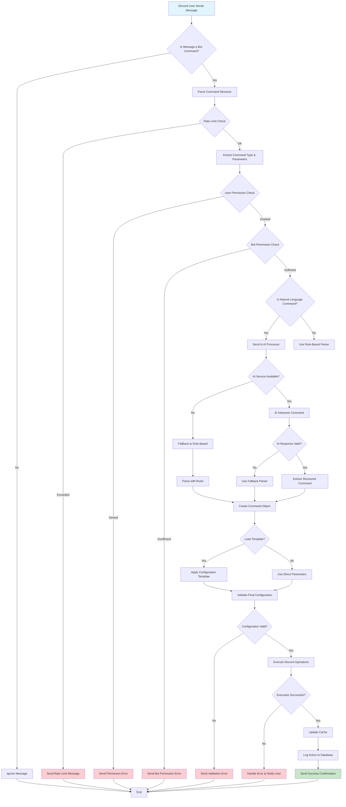
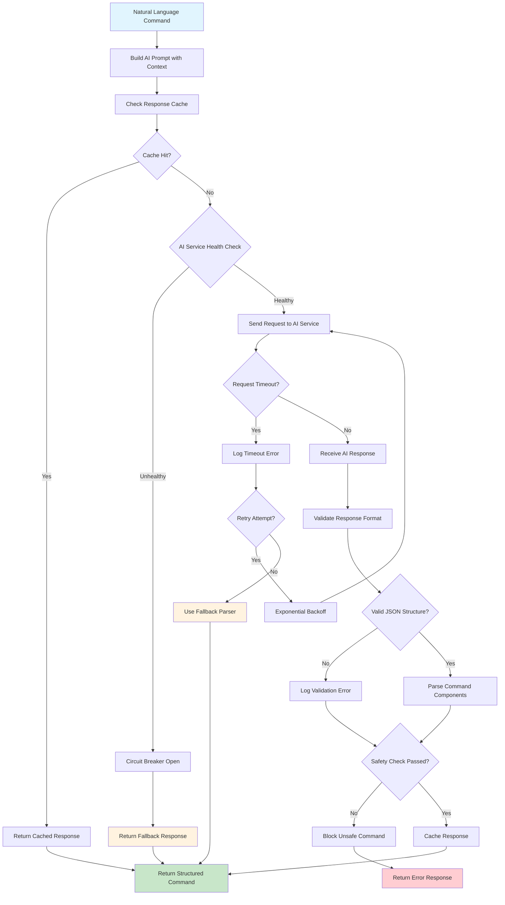
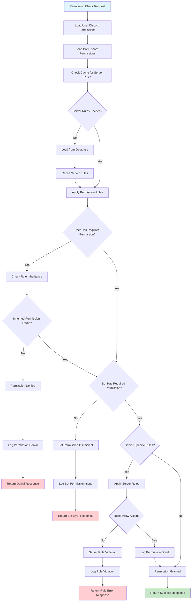
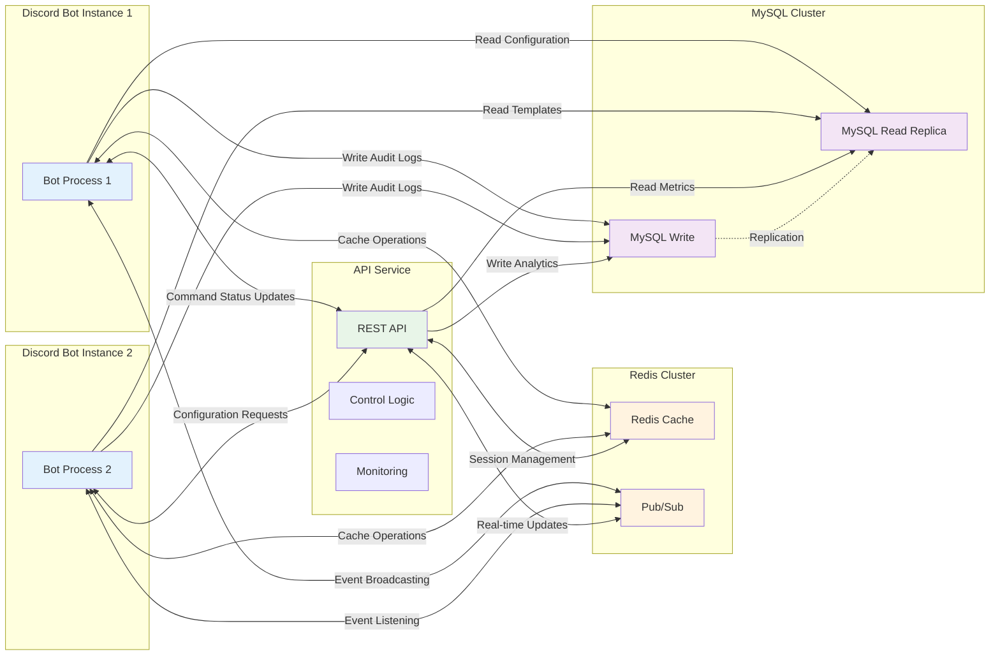
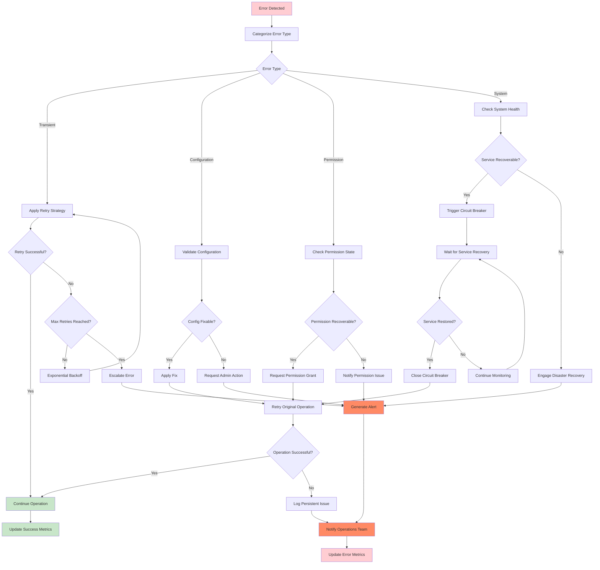
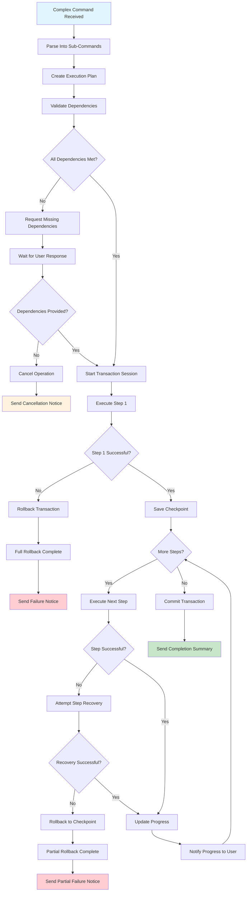
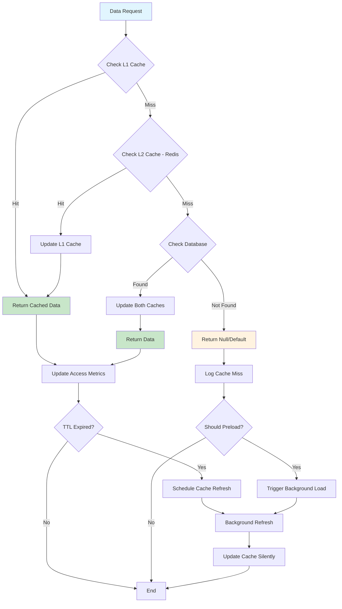

# Process Flowcharts

## Overview
This document contains flowcharts that illustrate the key processes within the SetAi Bot system, from user interaction to command execution and system coordination.

## Command Processing Workflow

### Main Command Flow

### AI Processing Subflow

### Permission Validation Flow

## System Communication Flows

### Bot-API-Redis-MySQL Coordination

### Error Handling and Recovery Flow

### Multi-Step Command Execution

## Performance Optimization Flows

### Caching Strategy Flow

---

**Document Type**: Process Flowcharts  
**Last Updated**: August 2024  
**Related**: [C4 Architecture Diagrams](./README.md)